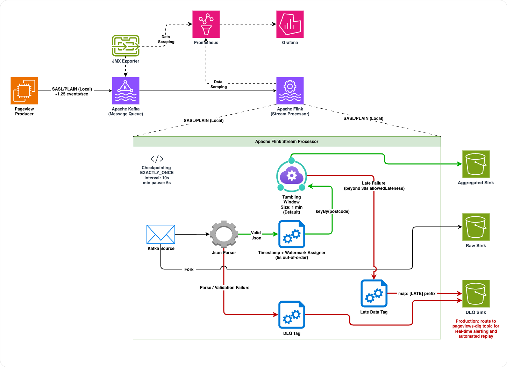

# realtime-pageview-aggregator

Streaming pipeline that ingests simulated web-page visit events, aggregates them by UK postcode over tumbling event-time windows, and writes three output streams — raw, aggregated, and dead-letter queue — to the local filesystem.

## Table of Contents
- [Architecture](#architecture)
- [Quick Start](#quick-start)
- [The Mission](#the-mission)
- [Design Rationale](#design-rationale)
- [System Layout](#system-layout)
- [Pipeline Architecture](#pipeline-architecture)
- [Interface Definition](#interface-definition)
- [Security](#security)
- [Monitoring & Alerting](#monitoring--alerting)
- [Automation](#automation)
- [Reliability & Failure Modes](#reliability--failure-modes)
- [Testing](#testing)
- [Growth & Throughput](#growth--throughput)
- [Financial Impact](#financial-impact)
- [Known Gaps](#known-gaps)
- [Evolution Path](#evolution-path)

---

## Architecture

<p align="center">
  
</p>

---

## Quick Start

Requires Docker, Docker Compose, Java 17, Maven and a POSIX shell with `make`.

```shell

# Demo credentials are pre-filled in configuration/.env — no edits needed.
# To use custom credentials, edit configuration/.env before running make all.
make all
```

`make all` compiles both Maven modules, starts all Docker containers, waits for Kafka to become healthy, creates the `pageviews-raw` topic, waits for the Flink JobManager, and submits the streaming job — in that order. After it completes:

| Service | URL |
|---|---|
| Flink UI | http://localhost:8081 |
| Kafka UI | http://localhost:7070 |
| Prometheus | http://localhost:9090 |
| Grafana | http://localhost:3000 |

Output lands on the host filesystem under `output/` (mounted into both Flink containers at `/opt/flink/output`):

```
output/
  raw/          # every event as received from Kafka, one JSON object per line
  aggregated/   # per-postcode window counts in JSON
  dlq/          # malformed, invalid, and late-arriving events
```

To tear down: `make down`

> **Note:** The `output/` directory is git-ignored. Flink writes part files that start with a dot until they roll, so do not mistake an empty directory for a broken job.

---

## The Mission

A website receives up to 100,000 page visits per day across a set of UK postcodes. Each visit is a JSON event containing a user ID, postcode, URL path, and Unix epoch-second timestamp. The pipeline answers: "How many page views did each postcode receive within each one-minute window?"

Constraints:

- **Event-time semantics**: events carry their own timestamp; the aggregation must be correct regardless of producer-to-broker delivery jitter.
- **Exactly-once output**: Flink checkpoints at EXACTLY_ONCE mode ensure exactly-once semantics from Kafka source to file sink. Note: the producer-to-Kafka leg uses idempotent sends within a single session, which resets on container restart; end-to-end exactly-once is therefore conditional on stable producer session lifecycle.
- **Raw data preservation**: the unmodified Kafka payload is written to a separate sink before any parsing, providing a full audit trail.
- **Explicit dead-letter handling**: events that cannot be processed must be captured and observable rather than silently dropped.
- **Single-command local setup**: the entire stack — broker, consumer, processor, and observability — runs via `make all` with no manual steps.

---

## Design Rationale

Kafka as the durable event bus, Flink as the stateful stream processor. That pairing gives event-time correctness, exactly-once guarantees, and horizontal scalability out of the box. Every structural decision (partitioned topic, keyed stream, checkpointed state, side-output DLQ) is made to hold at production load, not just at the current demo rate.

Why this stack:

1. **Streaming fundamentals are the target competency.** The problem requires event-time semantics, watermarks, windowed aggregation, and exactly-once processing. A batch or serverless approach would produce the correct output but would not exercise any of those properties.
2. **The pipeline scales horizontally without a rewrite.** Increasing throughput by an order of magnitude is a configuration change — more partitions, more TaskManagers, higher parallelism. No operator logic changes.
3. **Observability comes for free.** Prometheus metrics, Grafana dashboards, consumer lag alerting, and DLQ tracking are native to this stack. Equivalent coverage on a serverless batch pipeline requires assembling CloudWatch, X-Ray, and custom metric adapters.

### Scaling Envelope

| Tier | Throughput | Changes required |
|---|---|---|
| Current (this repo) | ~1.25 events/sec | Single TaskManager, parallelism 1, `HashMapStateBackend` |
| Horizontal scale-out | ~10K events/sec | Add Kafka partitions + TaskManager replicas, set `--parallelism N` — zero code changes |
| Mid-scale hardening | ~10K–100K events/sec | Schema Registry + Avro, `RocksDBStateBackend` with incremental checkpointing, S3 checkpoint storage |
| High-scale production | 100K+ events/sec | Multi-broker Kafka cluster (`replication-factor=3`), dedicated Flink cluster, S3 sinks with compaction and lifecycle policies |

At the current volume of ~108,000 events/day, a scheduled Lambda or Kafka Connect sink would be the pragmatic choice for a greenfield system with no growth expectation. The streaming stack is chosen here because the architecture needs to be correct before it needs to be minimal.

---

## System Layout

```
realtime-pageview-aggregator/
├── pageview-data-producer/               # Spring Boot app: generates and publishes mock events to Kafka
│   ├── src/
│   │   ├── main/
│   │   │   ├── java/                     # ProducerApplication, DataGeneratorService, PageviewEvent model
│   │   │   └── resources/
│   │   │       └── application.yaml      # Kafka producer config, SASL credentials, scheduling rate
│   │   ├── test/
│   │   │   └── java/                     # DataGeneratorServiceTest (Mockito unit tests)
│   │   └── it/
│   │       └── java/                     # DataGeneratorServiceIT (TestContainers integration test), SaslKafkaContainer
│   ├── Dockerfile                        # eclipse-temurin:17-jre, copies the Spring Boot fat JAR
│   └── pom.xml
│
├── pageview-stream-processor/            # Flink streaming job: parses, validates, aggregates, sinks
│   ├── src/
│   │   ├── main/
│   │   │   ├── java/
│   │   │   │   ├── PageviewAggregatorJob.java  # Topology orchestration; exposes wireTopology() for tests
│   │   │   │   ├── config/               # JobParameters, CredentialHelper, CheckpointConfigurer
│   │   │   │   ├── model/                # PageviewEvent (Flink side, Serializable, @JsonIgnoreProperties)
│   │   │   │   ├── source/               # KafkaSourceFactory (SASL_PLAINTEXT, committedOffsets)
│   │   │   │   ├── sink/                 # FileSinkFactory (rolling policy: 1 min / 30s idle / 10 MB)
│   │   │   │   ├── operator/             # CountAggregator (AggregateFunction), WindowResultFormatter
│   │   │   │   └── util/                 # JsonParserProcessFunction (DLQ routing), PageviewWatermarkStrategy
│   │   │   └── resources/
│   │   │       └── log4j2.xml            # Flink job logging configuration
│   │   └── test/
│   │       ├── java/                     # Unit tests (Flink TestHarness, Mockito) + MiniCluster integration tests
│   │       └── resources/
│   │           └── log4j2-test.xml       # Logging config scoped to the test classpath
│   └── pom.xml                           # maven-shade-plugin produces fat JAR; flink-streaming-java is 'provided'
│
├── infrastructure/
│   ├── docker-compose.yaml               # Root compose file: includes the four service-specific files below
│   ├── docker-compose.kafka.yaml         # Kafka broker (KRaft, SASL_PLAINTEXT) + Kafka UI
│   ├── docker-compose.flink.yaml         # Flink JobManager + TaskManager (flink:1.20.2-java17)
│   ├── docker-compose.app.yaml           # pageview-producer container
│   ├── docker-compose.observability.yaml # Prometheus + Grafana + kafka-jmx-exporter sidecar
│   └── kafka/
│       ├── jaas.conf.template            # JAAS template for production credential injection
│       └── jmx-exporter-config.yaml      # Mounted into the kafka-jmx-exporter sidecar; maps Kafka JMX MBeans to Prometheus metrics
│
├── configuration/
│   └── .env.template                     # All environment variable keys with placeholder values; copy to .env to run
│
├── monitoring/
│   ├── prometheus.yml                    # Scrapes jobmanager:9249, taskmanager:9249, and kafka-jmx-exporter:5556 every 5s
│   └── grafana/
│       ├── dashboards/
│       │   └── flink-dashboard.json      # 10-panel Grafana dashboard (Flink metrics rows + Kafka broker row)
│       └── provisioning/                 # Grafana auto-provisioning; no manual UI wiring required
│           ├── datasources/
│           │   └── datasource.yml        # Configures Prometheus as the default datasource at http://prometheus:9090
│           ├── dashboards/
│           │   └── dashboards.yml        # Points Grafana at the dashboards/ directory on startup
│           └── alerting/
│               └── alert-rules.yml       # Consumer lag alert rule for flink-aggregator-group
│
├── document/
│   └── birds_eye_view.png                # Architecture diagram: end-to-end data-flow from producer to sinks
│
├── output/
│   └── .gitkeep                          # Keeps the output/ directory in version control; runtime files are git-ignored
│
├── .mvn/wrapper/
│   └── maven-wrapper.properties          # Pins the Maven version used by mvnw
├── mvnw                                  # Maven wrapper script (Unix)
├── mvnw.cmd                              # Maven wrapper script (Windows)
├── Makefile                              # Orchestrates: build → up → wait-for-kafka → create-topic → wait-for-flink → submit-job
└── pom.xml                               # Parent POM: Java 17, Flink 1.20.2, Spring Boot 4.0.3, TestContainers 1.19.7
```

---

## Pipeline Architecture

The data-flow diagram in the `document/` folder shows the full path from the Spring Boot producer through the Kafka broker, Flink operator graph, and into the three output sinks — including where the DLQ side-output branches off and how watermarks are applied post-parse.

The five operator branches in `PageviewAggregatorJob` are: raw passthrough sink, JSON parse with DLQ routing, watermark assignment, tumbling window aggregation, and late-data capture. Each is a named node visible in the Flink UI's job graph view.

> **Note:** If the Flink UI job graph looks wrong, verify the job was submitted with the fat JAR from `target/`. `make all` rebuilds before submitting, but `make submit-job` does not.

---

## Interface Definition

### Kafka Message (producer → broker)

**Topic**: `pageviews-raw` | **Partitions**: 3 | **Key**: postcode string

```json
{
  "user_id": 4821,
  "postcode": "SW19",
  "webpage": "www.website.com/products.html",
  "timestamp": 1700000000
}
```

Note: `timestamp` is Unix epoch-seconds (not milliseconds). The Flink watermark assigner multiplies by 1000 internally.

### Raw Sink Output (`output/raw/`)

Unmodified JSON strings as received from Kafka, written one per line. File format matches the Kafka message above exactly:

```
{"user_id":4821,"postcode":"SW19","webpage":"www.website.com/products.html","timestamp":1700000000}
{"user_id":3012,"postcode":"E14","webpage":"www.website.com/index.html","timestamp":1700000001}
```

> **Note:** Flink writes these as `part-*` files inside date-partitioned subdirectories. They become visible as complete files after the rolling policy triggers (1 min elapsed, 30s inactivity, or 10 MB).

### Aggregated Sink Output (`output/aggregated/`)

One JSON object per closed tumbling window per postcode:

```json
{"postcode":"SW19","window_start":"2023-11-14T22:13:00Z","window_end":"2023-11-14T22:14:00Z","count":4}
{"postcode":"E14","window_start":"2023-11-14T22:13:00Z","window_end":"2023-11-14T22:14:00Z","count":2}
```

Both `window_start` and `window_end` are ISO-8601 UTC strings derived from the Flink `TimeWindow` boundaries. `count` is a `long`.

### DLQ Output (`output/dlq/`)

Events are written to the DLQ under two conditions:

| Condition | Written as |
|---|---|
| JSON parse failure | original raw string |
| `postcode` is null or blank | original raw string |
| `timestamp` before 2020-01-01T00:00:00Z (epoch-s < 1577836800) | original raw string |
| `timestamp` more than 1 hour in the future | original raw string |
| Event arrived after the 30-second allowed-lateness grace period | `[LATE] PageviewEvent(userId=..., postcode=..., ...)` |

The `dlq_routed_count` Flink metric tracks total DLQ emissions and is scraped by Prometheus.

### Flink REST API (read-only, for monitoring)

| Endpoint | Description |
|---|---|
| `GET http://localhost:8081/jobs` | List all running jobs |
| `GET http://localhost:8081/jobs/{jobId}` | Job detail, task states |
| `GET http://localhost:8081/jobs/{jobId}/metrics` | Job-level metrics |

### Retention Policy

**Kafka topic retention.** The `pageviews-raw` topic uses Kafka's default `retention.ms` of 604800000 (168 hours / 7 days) with delete-based cleanup. Log compaction is not enabled because compaction retains only the latest record per key, which would discard the time-series history the pipeline depends on — every event is a distinct observation, not a mutable state update. At 108K events/day with approximately 150 bytes per event, 7 days of retention consumes roughly 110 MB, negligible for a single broker. At scale, retention should be tuned to the recovery window: how far back must the Flink job rewind on a cold restart? If checkpoints are healthy and committed offsets are current, 24-hour retention is sufficient; longer retention provides a safety net for extended outages.

**Output file and DLQ retention.** No lifecycle policy is applied to the `output/` directories. Files accumulate indefinitely. In production with S3 or GCS sinks, object lifecycle rules should enforce explicit limits — for example, 90-day expiry on raw output, 1-year on aggregated, and 30 days on DLQ files. For a Kafka-backed DLQ (see Evolution Path), the DLQ topic should carry a shorter retention than the main topic (e.g., 72 hours) paired with an alerting threshold: if DLQ records are not investigated before the retention window closes, they are permanently lost with no replay path.

---

## Security

### SASL/PLAIN Authentication

All three Kafka client roles use SASL_PLAINTEXT with the PLAIN mechanism:

- **Broker (KRaft)**: authenticates inter-broker traffic and external clients via a JAAS `KafkaServer` stanza loaded from `/etc/kafka/jaas.conf` at broker startup. The broker exposes three listener protocols: `CONTROLLER` (plaintext, internal only), `INTERNAL` (SASL_PLAINTEXT, container-to-container on port 29092), and `EXTERNAL` (SASL_PLAINTEXT, host access on port 9092).
- **Producer**: credentials are injected as `KAFKA_PRODUCER_USERNAME` / `KAFKA_PRODUCER_PASSWORD` environment variables into the `pageview-producer` container and expanded into `sasl.jaas.config` in `application.yaml`.
- **Flink job**: credentials are injected as `KAFKA_FLINK_USERNAME` / `KAFKA_FLINK_PASSWORD` environment variables on the `flink-jobmanager` container. `CredentialHelper` reads them at job startup and prefers env vars over CLI parameters to prevent them from appearing in `ps aux` output. `CredentialHelper.scrubSecrets()` strips both keys before registering parameters globally, so they never appear in Flink's parameter logging.

### Why KRaft Mode

KRaft eliminates the ZooKeeper process, reducing the local stack from five containers to four. For a single-node demo cluster there is no meaningful trade-off: KRaft provides the same metadata coordination without the additional JVM, port mapping, and health-check surface.

> **Note:** If broker logs show metadata request failures, check the SASL handshake first. The most common cause is a mismatched `jaas.conf` stanza versus the env var credentials passed to the Kafka UI or Flink container.

### Credential Files

Two template files are committed to the repository to document the required credential surface:

- `configuration/.env.template`: lists all environment variable keys with placeholder values. Copy to `configuration/.env` and fill in for production use.
- `infrastructure/kafka/jaas.conf.template`: shows the JAAS `KafkaServer` block structure for production broker deployments.

**Note on demo credentials**: `configuration/.env` and `infrastructure/kafka/jaas.conf` (the non-template, populated files) contain demo credentials and are committed intentionally so that `make all` works immediately after cloning. This is appropriate for a local development pipeline. In a production deployment, both files must be excluded from version control (both are already in `.gitignore`), and credentials should be sourced from a secrets manager (Vault, AWS Secrets Manager, or Kubernetes Secrets).

### Data Classification

The event payload contains a `user_id` field. In this assessment it is a synthetic integer with no linkage to real identities. In a production deployment where `user_id` maps to an authenticated session or account, it must be classified as PII. The raw passthrough sink writes every unmodified payload to disk, creating a PII-at-rest risk. Mitigations include field-level redaction before writing to the raw sink, encryption at rest on the output path, or exclusion of `user_id` from the raw sink entirely. The aggregated output (`output/aggregated/`) contains only postcode-level counts and carries no PII risk. Data retention policies on output files are not configured — in production, an expiry-based lifecycle policy (e.g., S3 object expiration) should enforce retention limits.

### Kafka ACLs

No topic-level ACLs are configured. All authenticated principals have full broker access. In production, each identity should be granted minimum permissions:

| Principal | Permissions |
|---|---|
| Producer | `WRITE` on `pageviews-raw` |
| Flink consumer | `READ` on `pageviews-raw`, `DESCRIBE` on consumer group `flink-aggregator-group` |
| Kafka UI | `DESCRIBE` and `READ` on all topics (read-only) |

KRaft's `StandardAuthorizer` (`authorizer.class.name=org.apache.kafka.metadata.authorizer.StandardAuthorizer`) and the `super.users` broker property would enforce this boundary. The current open-access model was chosen to keep the local Docker stack operational without ACL bootstrapping complexity.

---

## Monitoring & Alerting

### Metrics

Two scrape targets: the Flink Prometheus reporter and the Kafka broker JMX exporter.

**Flink metrics** — the Prometheus reporter is enabled on both `jobmanager` and `taskmanager` via `FLINK_PROPERTIES` (`metrics.reporter.prom.factory.class`, port 9249). Prometheus scrapes both targets every 5 seconds.

**Kafka broker metrics** — the broker exposes JMX on port 9101 via `KAFKA_JMX_PORT`. A `kafka-jmx-exporter` sidecar container (defined in `docker-compose.observability.yaml`) connects to that port over RMI, reads `infrastructure/kafka/jmx-exporter-config.yaml`, maps JMX MBeans to Prometheus metric names, and exposes them on port 5556 (mapped to host port 7071). Prometheus scrapes the sidecar as the `kafka-broker` job. This sidecar approach avoids injecting a javaagent into the broker JVM, which caused ~140-second startup hangs.

Key metrics to watch:

| Metric | Source | What it indicates |
|---|---|---|
| `flink_taskmanager_job_task_numRecordsInPerSecond` | Flink | Consumer throughput — should track ~1.25 events/sec |
| `flink_taskmanager_job_task_numRecordsOutPerSecond` | Flink | Aggregation output rate — one record per closed window per postcode |
| `dlq_routed_count` (custom counter in `JsonParserProcessFunction`) | Flink | Cumulative DLQ emissions; non-zero after startup means bad data is arriving |
| `flink_jobmanager_job_uptime` | Flink | Job health; resets to 0 on failure or restart |
| Checkpoint duration metrics | Flink | Rising durations signal I/O pressure or state growth |
| `kafka_server_broker_topic_metrics_messagesinpersec_oneminuterate` | Kafka JMX | Messages arriving at the broker per second, per topic — the ground-truth ingest rate |
| `kafka_server_broker_topic_metrics_bytesinpersec_oneminuterate` | Kafka JMX | Inbound byte rate; useful for capacity planning and network saturation checks |
| `kafka_server_broker_topic_metrics_bytesoutpersec_oneminuterate` | Kafka JMX | Outbound byte rate — covers Flink consumer fetch traffic |
| `kafka_server_request_handler_avg_idle_percent_oneminuterate` | Kafka JMX | Request handler thread idle ratio; values below 0.2 indicate CPU saturation |
| `kafka_server_replica_manager_underreplicatedpartitions` | Kafka JMX | Under-replicated partition count; should be 0 on a healthy broker |
| `kafka_server_replica_manager_partitioncount` | Kafka JMX | Total partition count hosted by this broker |

### Grafana

Grafana starts on port 3000. The admin password is set from `GF_ADMIN_PASSWORD` in `configuration/.env`. The stack is fully provisioned on startup:

- **Datasource**: the Prometheus datasource is automatically configured at `http://prometheus:9090` via a provisioning config file — no manual wiring is required.
- **Dashboard**: a 10-panel dashboard is provisioned automatically in `monitoring/grafana/dashboards/flink-dashboard.json`. Panels are organised across three rows:
  - Row 1 (y=0): Consumer Lag, Records Out (Throughput), DLQ Routed Count.
  - Row 2 (y=8): Records In (Ingestion Rate), Checkpoint Duration, Job Uptime.
  - Row 3 (y=16, Kafka broker): Messages In Per Sec for `pageviews-raw`, Network Throughput (bytes in/out), Request Handler Idle Ratio, Replica Manager state (partitions, leaders, under-replicated count).
- **Alert rule**: a consumer lag alert rule is provisioned and fires when the Flink consumer group `flink-aggregator-group` exceeds a configurable lag threshold.

> **Note:** only the consumer lag alert is provisioned. A production deployment should add a threshold alert on `dlq_routed_count` (e.g., fire when the counter increases by more than 10 in a 5-minute window) to detect data quality degradation in real time.

> **Note:** Kafka broker panels in row 3 will show no data until the `kafka-jmx-exporter` sidecar has connected to port 9101 and completed its first scrape. Allow 15–20 seconds after the Kafka container passes its health check.

### SLOs and Recovery Objectives

**Service-Level Objectives (SLOs)**

| SLO | Target | Measurement |
|---|---|---|
| Ingestion availability | 99.9% of minutes with records flowing | `flink_taskmanager_job_task_numRecordsInPerSecond > 0` sustained over 1-minute windows |
| Aggregation freshness | Window results appear within 120 seconds of window close | End-to-end latency: watermark lag (5s) + window (60s) + checkpoint (10s) + idle timeout (30s) ≈ 105s worst case |
| DLQ ratio | < 0.1% of ingested events routed to DLQ | `dlq_routed_count / numRecordsIn` over a rolling 1-hour window |
| Checkpoint success rate | 100% of checkpoints complete within timeout | `flink_jobmanager_job_lastCheckpointDuration < 60000` (the configured timeout) |

**Recovery Objectives**

| Metric | Value | Basis |
|---|---|---|
| RPO (Recovery Point Objective) | 10 seconds | Checkpoint interval — on failure, the job replays at most 10 seconds of events from the last successful checkpoint |
| RTO (Recovery Time Objective) | 30–60 seconds | TaskManager restart (~10s) + checkpoint restore (~5s) + Kafka consumer rebalance (~10–30s) + watermark catchup |

**Error Budget**

At 99.9% ingestion availability, the error budget is roughly 1.5 minutes of downtime per day or 43 minutes per month. A single TaskManager crash consuming the full RTO (60 seconds) uses ~70% of the daily budget. This means the pipeline tolerates at most one unplanned restart per day before breaching the SLO — reinforcing the importance of checkpoint health monitoring and proactive alerting on consumer lag.

> **Note:** These are production targets, not enforced guarantees in the local Docker setup. The monitoring stack provides measurement; enforcement requires an incident management process.

### Checkpoint Policy

`CheckpointConfigurer` applies the following to every job execution:

| Parameter | Value | Rationale |
|---|---|---|
| Checkpointing mode | EXACTLY_ONCE | No duplicate window counts on restart |
| Checkpoint interval | 10,000 ms | Recovery point every 10 seconds |
| Min pause between checkpoints | 5,000 ms | Prevents checkpoint saturation under backpressure |
| Checkpoint timeout | 60,000 ms | Fails stuck checkpoints rather than blocking indefinitely |
| Max concurrent checkpoints | 1 | Avoids overlapping checkpoint I/O |
| On cancellation | RETAIN | Checkpoint data survives manual job cancellation for manual recovery |

The job uses `HashMapStateBackend` (the Flink default). Window state per postcode is negligible — 6 postcodes, each holding a single long accumulator — so there is no justification for the operational overhead of RocksDB. `RocksDBStateBackend` is the correct production choice when state grows beyond JVM heap (e.g., large keyed state, long retention windows, or high-cardinality key spaces) or when incremental checkpointing is needed to reduce checkpoint size. Checkpoint storage in this setup writes to the local mounted filesystem (`/opt/flink/output`). In a production deployment this path would target S3 or GCS for durability and cross-node accessibility.

> **Note:** Lowering the 10-second checkpoint interval reduces recovery point objective but increases I/O pressure on the TaskManager. The 5-second min-pause is a guard against checkpoint storms under sustained backpressure.

### Flink TaskManager Logs

```shell

make logs
```

This tails `docker compose logs -f taskmanager`. Parser DLQ warnings, window closures, and checkpoint confirmations are all visible here.

---

## Automation

A single `Makefile` drives the full lifecycle — no manual steps between clone and running pipeline.

`make all` chains six targets in sequence: `build` → `up` → `wait-for-kafka` → `create-topic` → `wait-for-flink` → `submit-job`. Each target is idempotent and can be re-run independently.

| Command | Description |
|---|---|
| `make all` | Full pipeline: build → up → wait-for-kafka → create-topic → wait-for-flink → submit-job |
| `make build` | Compile, run all tests (unit + MiniCluster + IT), package fat JAR |
| `make up` | Start all Docker containers with `--force-recreate` |
| `make wait-for-kafka` | Poll broker with SASL credentials until ready (120s timeout) |
| `make create-topic` | Create `pageviews-raw` with 3 partitions via `--if-not-exists` |
| `make wait-for-flink` | Poll Flink REST API until JobManager responds (120s timeout) |
| `make submit-job` | Submit the streaming job to the Flink cluster in detached mode |
| `make logs` | Tail the Flink TaskManager logs |
| `make down` | Stop and remove all Docker containers |

> **Note:** `auto.create.topics.enable` is set to `false` on the broker. Without this, the producer races the `create-topic` target and Kafka silently creates the topic with 1 partition instead of 3.

Infrastructure is defined entirely in Docker Compose (five compose files included from a root orchestrator). No Terraform was used because the task offers two paths — AWS/Kinesis with Terraform, or Kafka with Docker — and this implementation follows the Kafka path.

---

## Reliability & Failure Modes

### Why Flink Side-Outputs for DLQ

The alternative to side-outputs for dead-letter handling is a `try/catch` inside the main processing function that writes bad records to a separate Kafka topic or logs them. Both approaches have significant drawbacks: a secondary Kafka write inside a process function couples error handling to a network call with its own failure modes, and logging bad records provides no downstream queryability.

Flink's `OutputTag` / side-output mechanism routes rejected records as a typed secondary stream within the same operator graph. This means:

- The DLQ stream shares Flink's exactly-once checkpoint semantics with the main stream — a bad record that has been checkpointed to the DLQ cannot be re-emitted on restart.
- The DLQ path is visible in the Flink UI as a named sink ("DLQ Sink"), making the flow auditable without inspecting code.
- No additional network calls are introduced into the hot path; the routing is an in-process collector dispatch.

The `JsonParserProcessFunction` maintains a `dlq_routed_count` Prometheus counter, giving operators a quantitative signal for data quality degradation without needing to grep log output.

### FileSink Delivery Guarantees

Flink's `FileSink` provides exactly-once delivery via a two-phase commit file lifecycle. Each part file transitions through three states: `.inprogress` (being written by a task), `.pending` (write complete, awaiting checkpoint confirmation), and a final committed file (renamed on successful checkpoint completion). The checkpoint barrier is the trigger for the `.pending` → final transition; no downstream reader can observe a partial file before its checkpoint epoch has been confirmed.

If a checkpoint fails, in-progress files are discarded and the operator state is rolled back to the last successful checkpoint. The part files are re-written from that recovery point, ensuring no record is lost and no duplicate committed file is produced.

The rolling policy (1 minute elapsed / 30 seconds idle / 10 MB) means that at low throughput — such as the current 1.25 events/second — files roll on the idle timeout rather than on size, producing many small part files. This is a known trade-off documented in Known Gaps.

On a local Docker host-mounted filesystem, the two-phase commit depends on the OS honouring `fsync` and atomic rename semantics. An abrupt Docker daemon crash — as distinct from a Flink task failure — can leave `.pending` files in an indeterminate state that Flink's recovery logic cannot automatically resolve. This is acceptable for local development and functional testing. In production, the `FileSink` should target S3 or HDFS, where atomic rename and commit guarantees are well-defined.

> **Note:** The `.inprogress` and `.pending` files visible in `output/` during a running job are normal. They become permanent part files after the next checkpoint completes.

### What Happens on Flink Task Failure

The job is submitted in detached mode (`flink run -d`). The Flink cluster has a single TaskManager with 2 slots. If the TaskManager crashes, the JobManager will attempt to restart it. With `RETAIN_ON_CANCELLATION`, checkpoint state is preserved on the filesystem (`/opt/flink/output` is host-mounted), so a restarted job resumes from the last completed checkpoint rather than rewinding to the earliest Kafka offset.

### Kafka Offset Behaviour

`KafkaSourceFactory` uses `OffsetsInitializer.committedOffsets(OffsetResetStrategy.EARLIEST)`. On the first run, no committed offset exists for consumer group `flink-aggregator-group`, so the consumer starts from the beginning of the topic. On subsequent runs or restarts, it resumes from the last committed offset. The Flink Kafka source commits offsets as part of checkpointing, not on a timer, so offset commits are strictly tied to checkpoint completion.

### Event-Time Correctness

The watermark strategy uses `forBoundedOutOfOrderness(Duration.ofSeconds(5))`, meaning the watermark lags the maximum observed event timestamp by 5 seconds. Events arriving up to 5 seconds late (relative to the current watermark) are included in the correct window. Events arriving 5–35 seconds late (within the `allowedLateness(Duration.ofSeconds(30))` grace period) trigger a window re-emission with an updated count. Events arriving beyond 35 seconds after their window end are emitted via `lateDataTag` to the DLQ with a `[LATE]` prefix.

> **Note:** The 5-second out-of-orderness bound is sized for network jitter and out-of-order delivery between producer, broker, and consumer — not solely for the 800ms emission rate. Increase it if you introduce real network latency or multi-datacenter routing.

> **Note:** Watermarks are applied post-parse because the Kafka source emits raw strings, making per-partition watermark tracking unavailable at the source stage. Replace `SimpleStringSchema` with a custom `KafkaDeserializationSchema` to enable per-partition watermark advancement.

### DLQ Validation Thresholds

The `JsonParserProcessFunction` enforces three DLQ routing rules: null or blank postcode, timestamp before 2020-01-01 (`MIN_VALID_TIMESTAMP_MS`), and timestamp more than 1 hour in the future (`MAX_FUTURE_DRIFT_MS`). These thresholds are currently compile-time constants defined in the class. In production systems, these validation rules should be externalized to a configuration source — such as Flink's `ParameterTool`, a config service, or a rules engine — so that policy changes do not require a job redeploy.

---

## Testing

### Test Coverage

**`pageview-stream-processor` — unit tests (JUnit 5, Mockito, AssertJ, Flink TestHarness)**

| Test class | What it covers |
|---|---|
| `JsonParserProcessFunctionTest` | 10 cases: valid JSON parse, malformed JSON to DLQ, null postcode to DLQ, blank postcode to DLQ, unknown fields ignored (`@JsonIgnoreProperties`), pre-2020 timestamp to DLQ, far-future timestamp to DLQ, zero timestamp to DLQ, recent valid timestamp passes, multiple events in sequence |
| `CountAggregatorTest` | Accumulator initialisation, increment-by-one per event, result retrieval, merge of two partial accumulators |
| `WindowResultFormatterTest` | Valid JSON output shape, both window boundaries present and correct in ISO-8601 UTC |
| `PageviewWatermarkStrategyTest` | Epoch-second to millisecond conversion for fixed, recent, and arbitrary timestamps |
| `CredentialHelperTest` | Env var preference over CLI param, exception on missing both, secret keys scrubbed from ParameterTool, non-secret keys preserved |
| `CheckpointConfigurerTest` | EXACTLY_ONCE mode, 10s interval, 5s min pause, 60s timeout, max 1 concurrent checkpoint, RETAIN_ON_CANCELLATION |
| `JobParametersTest` | Default value resolution, custom value override |
| `KafkaSourceFactoryTest` | Non-null KafkaSource built without exception from valid JobParameters |

**`pageview-stream-processor` — MiniCluster integration test**

`PageviewAggregatorJobIntegrationTest` uses Flink's `MiniClusterExtension` (embedded single-JVM Flink cluster, 1 TaskManager, 4 slots) and the package-private `wireTopology()` overload in `PageviewAggregatorJob`. It exercises the full operator graph — parse, DLQ routing, windowed aggregation — against an in-memory bounded source.

| Test case | Assertion |
|---|---|
| 2× SW19 + 1× E14 valid events | Raw sink has 3, DLQ empty, agg has 2 records with correct counts |
| 1 valid + 2 malformed JSON | 2 records in DLQ, 1 in agg |
| 1 valid + 1 pre-2020 timestamp + 1 far-future timestamp | 2 records in DLQ, 1 in agg (SW19 count = 1) |
| 1 valid + 1 null postcode + 1 blank postcode | 2 records in DLQ, 1 in agg |

> **Note:** MiniCluster tests take 5–10 seconds each because they spin up a full Flink runtime. Do not add them to a pre-commit hook.

**`pageview-data-producer` — unit tests (JUnit 5, Mockito)**

`DataGeneratorServiceTest` mocks `KafkaTemplate` and verifies:
- A single call to `generateAndPublishEvent()` results in exactly one `kafkaTemplate.send(topic, key, event)` call.
- The Kafka message key equals the event's postcode (partition affinity guarantee).
- All sampled postcodes are from the known pool; userId is in `[1, 10000]`.
- A `RuntimeException` from `kafkaTemplate.send()` does not propagate — the scheduler thread stays alive.
- Repeated invocations (50 runs via `@RepeatedTest`) never produce blank postcodes, webpages, or non-positive timestamps.

**`pageview-data-producer` — integration test (TestContainers)**

`DataGeneratorServiceIT` spins up a real `confluentinc/cp-kafka:7.6.0` container via TestContainers and boots the full Spring Boot application context. It verifies that after calling `generateAndPublishEvent()` and flushing the `KafkaTemplate`, a record is consumable from the topic, the value is non-null, and the message key equals the event's postcode.

The TestContainers broker runs in KRaft mode with SASL_PLAINTEXT enabled on the external listener, mirroring the production Kafka configuration. A `SaslKafkaContainer` subclass copies a JAAS config file into the container, patches the listener security protocol map so the external listener uses SASL_PLAINTEXT, and sets `KAFKA_OPTS` accordingly (the cp-kafka image requires it when SASL is enabled). The `@DynamicPropertySource` injects the same `security.protocol`, `sasl.mechanism`, and `sasl.jaas.config` properties used by the real pipeline — both for the Spring Boot producer context and for the raw `KafkaConsumer` in the test body — verifying that the full SASL handshake works end-to-end.

### Running Tests

```shell

# Unit + MiniCluster integration tests (no Docker required — MiniCluster is in-JVM; allow ~1 minute)
./mvnw test

# Unit tests + integration tests (requires Docker for TestContainers)
./mvnw verify
```

The Failsafe plugin is configured to run classes matching `*IT.java` during the `verify` phase.

> **Note:** The producer integration test pulls `confluentinc/cp-kafka:7.6.0` on first run. Allow a minute for the image pull before concluding the test is hung.

---

## Growth & Throughput

### Current Capacity

The producer emits one event every 800 ms (~1.25 events/second, ~108,000 events/day). The Flink pipeline at parallelism 1 with a single TaskManager and 2 slots is sufficient for this load with significant headroom.

The Kafka topic is pre-created with 3 partitions. The producer keys each message by postcode; Kafka's default murmur2 partitioner distributes the 6-postcode key space (`SW19`, `E14`, `W1A`, `EC1A`, `N1`, `SE1`) across those 3 partitions, so each partition holds approximately 2 postcodes. All events for a given postcode still land in the same partition, which means no cross-partition shuffle is required when Flink keys the stream by postcode for windowing.

### Partitioning Strategy

The topic is configured with 3 partitions despite the pipeline operating over a 6-postcode key space. Partition count and business key cardinality are orthogonal concerns, and coupling them is a common mistake. The 3-partition choice proves that point directly: the same design works with 6 postcodes, 600, or 6 million — the partition topology does not change because the key space changes.

Kafka's default murmur2 partitioner hashes each message key and assigns it to a partition via modulo. With 6 postcodes and 3 partitions, each partition holds approximately 2 postcodes. The important part: all events for a given postcode always land in the same partition. Flink's `keyBy(postcode)` then enforces per-key routing within the Flink operator graph, independent of which physical partition the events arrived from. There is no requirement for a 1:1 partition-to-key mapping. Kafka guarantees per-key ordering within a partition; Flink guarantees per-key state isolation via `keyBy`. The two layers of routing are composable, not redundant.

**Headroom.** The current load is 1.25 events/second across the entire pipeline. A single Flink slot running this operator graph — Kafka source, watermark assignment, `keyBy(postcode)`, tumbling window, `CountAggregator`, and `FileSink` — sustains approximately 5,000–10,000 events/second before CPU becomes a constraint. With 3 partitions and 1 active slot, the architecture has three to four orders of magnitude of headroom before partitioning becomes the limiting factor.

**Production sizing.** Partition count must be sized by throughput, not by the number of distinct business keys. The reliable starting formula is:

```
partitions = max(target_TPS / single_partition_throughput, desired_consumer_parallelism)
```

Single-partition throughput on a single-broker Kafka node is typically 10–50 MB/s depending on message size and replication factor. At ~150 bytes per event, a single partition sustains roughly 65,000–330,000 events/second — orders of magnitude beyond the current load.

**Repartitioning.** Increasing the partition count on an existing topic changes the hash-mod mapping. Any logic that assumed a key always lands in a specific partition will silently break. Flink's `keyBy` is unaffected because it operates on key values, not partition indices, so correctness is preserved across repartitioning events. The two safe migration options are: (1) create a new topic with the target partition count, migrate the consumer group offset, and cut over the producer atomically; or (2) implement a custom `Partitioner` that encodes the transition mapping explicitly and retire it once migration is complete.

### Scaling the Flink Job

To increase throughput:

1. Add more TaskManager slots (`taskmanager.numberOfTaskSlots`) or add additional TaskManager replicas in `docker-compose.flink.yaml`.
2. Increase Flink job parallelism by passing `--parallelism N` to `flink run`. Parallelism should not exceed the number of Kafka partitions without diminishing returns on the source operator.
3. Increase the number of Kafka partitions (requires re-creating the topic if the topic already exists with data — partition rebalancing changes the key-to-partition mapping).

**Capacity Envelope**

The table below maps throughput tiers to concrete infrastructure requirements. Assumptions: ~150 bytes per raw event (JSON payload); 2 slots per TaskManager (`taskmanager.numberOfTaskSlots: 2`, as configured in `infrastructure/docker-compose.flink.yaml`); parallelism must not exceed partition count because a Flink source subtask with no assigned partition is idle and wastes a slot; network bandwidth figures are inbound from Kafka only and exclude checkpoint I/O and inter-operator shuffle.

| Throughput | Partitions | Parallelism | TaskManagers (2 slots each) | State Size | Checkpoint Duration | Network In |
|---|---|---|---|---|---|---|
| 1.25 events/s (current) | 3 | 1 | 1 | ~600 bytes | <100 ms | ~190 B/s |
| 100 events/s | 3 | 3 | 2 | ~600 bytes | <100 ms | ~15 KB/s |
| 1,000 events/s | 12 | 12 | 6 | ~1.2 KB (if 12 postcodes) | <200 ms | ~150 KB/s |
| 10,000 events/s | 24 | 24 | 12 | ~10 KB–10 MB (key-space dependent) | 200 ms–2 s | ~1.5 MB/s |
| 100,000 events/s | 48+ | 48 | 24+ | requires RocksDB if high cardinality | 2–10 s (incremental checkpointing recommended) | ~15 MB/s |

**Checkpoint Scaling Behavior**

With `HashMapStateBackend`, checkpoint duration scales linearly with state size. At 6 keys with `Long` accumulators, the total checkpoint payload is on the order of hundreds of bytes — checkpoints complete in sub-millisecond wall time regardless of event throughput because the bottleneck is not the operator itself but state serialization and I/O. Checkpoint duration becomes significant when state grows (high-cardinality keys, sliding windows with many concurrent open windows) or when checkpoint I/O contends with data processing for network or disk bandwidth. The current config sets `checkpointInterval=10s`, `minPauseBetweenCheckpoints=5s`, and `checkpointTimeout=60s` (`CheckpointConfigurer.java`), meaning a checkpoint that takes longer than 10 seconds will cause the next interval to be delayed — at scale this becomes a feedback loop where slow checkpoints reduce effective throughput. At the RocksDB migration point (~500K+ unique keys), switching to incremental checkpointing (`EnableIncrementalCheckpointing`) is essential: only changed SST files are uploaded to durable storage, keeping checkpoint duration proportional to the write rate rather than total accumulated state size.

**Throughput Per Slot**

A single Flink slot running this operator graph — Kafka source deserialize, watermark assignment, `keyBy(postcode)`, tumbling event-time window, `CountAggregator` (a single `Long` addition per event), and `FileSink` — can sustain approximately 5,000–10,000 events/second before CPU becomes a constraint, given the lightweight JSON parse and the trivial accumulator arithmetic. This means the 10,000 events/s tier in the table above is sitting at the upper bound of single-slot capacity and should be treated as the trigger point for increasing parallelism rather than a comfortable operating range. Beyond that tier, the bottleneck shifts from CPU to network I/O (Kafka fetch throughput and Flink network buffer pressure during keyBy shuffle) and checkpoint I/O (state snapshot upload latency), not the operator logic itself.

### End-to-End Latency

The worst-case latency from event production to appearance in `output/aggregated/` is composed of four independent delays:

| Component | Delay | Reason |
|---|---|---|
| Watermark lag | 5 s | `BoundedOutOfOrderness` holds the watermark back |
| Window duration | 60 s | Tumbling window must close before emitting |
| Checkpoint | 10 s | FileSink commits files on checkpoint completion |
| Rolling idle timeout | 30 s | File transitions from `.inprogress` to final on inactivity |

Worst case total: approximately 105 seconds. In practice, events near the start of a window experience the full delay; events near the end experience closer to 45 seconds (checkpoint + idle timeout). The dominant contributor is the 1-minute window itself — reducing the window size is the most impactful lever if lower latency is required.

### State Backend Migration Trigger

The job currently uses `HashMapStateBackend`, which holds all keyed state in JVM heap. Migrate to `RocksDBStateBackend` when any of the following conditions are met:

- The key space expands beyond the current 6 postcodes to high-cardinality keys (e.g., millions of user IDs), causing heap state to grow proportionally with parallelism.
- Session windows or other operators with unbounded or long-retention state are introduced, making heap-resident state impractical.
- Incremental checkpointing is required to reduce checkpoint size and duration at scale; RocksDB supports incremental snapshots while `HashMapStateBackend` always produces full snapshots.
- The aggregate state volume exceeds the TaskManager's available JVM heap, causing GC pressure or out-of-memory failures.

**State size modeling.** The `CountAggregator` accumulator is a single `Long` (8 bytes). `HashMapStateBackend` stores each keyed entry as a Java `HashMap` entry, which adds object header, key serialization, and bookkeeping overhead — approximately 50–100 bytes per key per open window in practice. Using 100 bytes per entry as a conservative upper bound, the formula is:

```
state_size ≈ unique_keys × concurrent_open_windows × 100 bytes
```

| Key cardinality | Concurrent windows | Estimated heap state |
|---|---|---|
| 6 postcodes (current) | 1 (tumbling) | ~600 bytes — negligible |
| 1,000 postcodes | 1 | ~100 KB |
| 100,000 user IDs | 1 | ~10 MB |
| 1,000,000 user IDs | 5 (sliding) | ~500 MB |

The TaskManager in `infrastructure/docker-compose.flink.yaml` sets no explicit `taskmanager.memory.process.size`, so Flink applies its default of **1,600 MiB** total process memory. After deducting network buffers, managed memory, and JVM overhead, the usable JVM heap available to keyed state is approximately **600–700 MB**. The 1M-key / 5-window scenario (~500 MB) would consume roughly 70–80% of that heap — the threshold at which GC pressure becomes the dominant latency driver and OOM risk is real. The practical migration threshold is therefore around **500,000 unique keys with a single open window**, or proportionally fewer keys if sliding windows multiply the concurrent open window count.

**Key skew.** With `keyBy(postcode)`, Flink assigns keys to subtasks via key group hashing. At 6 postcodes and parallelism 1 there is no distribution problem, but if parallelism were increased, all 6 keys would hash into at most 6 distinct key groups — some subtasks would receive no state at all. At low cardinality, skew from uneven traffic (e.g., 80% of events arriving for 10% of postcodes) is structurally unavoidable: you cannot spread a hot key across subtasks because all events for a given key must reach the same subtask for correctness. At high cardinality (100K+ keys), hash distribution smooths out and hot-key skew becomes a throughput concern rather than a memory-concentration concern — though a single extremely hot key (e.g., a bot flooding one postcode) will still saturate one subtask regardless of cardinality.

### State TTL

No `StateTtlConfig` is configured on this pipeline, which is correct for the current design: the `CountAggregator` is a plain `AggregateFunction` used inside a tumbling event-time window, and tumbling windows are self-cleaning — Flink purges the window accumulator and its associated metadata automatically once the window fires and the `allowedLateness` grace period (30 seconds here) expires, so a postcode that stops appearing simply produces no further windows and leaves no residual state. `StateTtlConfig` becomes necessary only when raw keyed state — `ValueState`, `MapState`, `ListState` held directly in a `KeyedProcessFunction` or `RichFlatMapFunction` — is introduced outside of a window operator: if the pipeline were extended to track per-user session state or maintain a running counter keyed by user ID, any key that disappears creates an orphaned state entry that accumulates indefinitely without a TTL. When that point is reached, Flink's `StateTtlConfig` offers three cleanup strategies to choose from: `cleanupFullSnapshot()`, which removes expired entries during checkpoint serialisation and is compatible with `HashMapStateBackend`; `cleanupIncrementally()`, which probabilistically scans a fraction of state entries on each access and suits low-latency heap-based backends; and `cleanupInRocksdbCompactFilter()`, which hooks into RocksDB's background compaction to evict expired keys inline — the production-grade choice at scale because it imposes no read-path overhead and reclaims disk space continuously. For this pipeline, no TTL is needed today, but it becomes a hard prerequisite the moment the key space grows unbounded — for example, if `keyBy(postcode)` were replaced with `keyBy(userId)`.

### Scaling the Kafka Tier

For production volumes, the single-broker setup must be replaced with a multi-broker cluster behind a load balancer. `KAFKA_OFFSETS_TOPIC_REPLICATION_FACTOR` and `KAFKA_TRANSACTION_STATE_LOG_REPLICATION_FACTOR` are currently `1` and must be increased to match the broker count.

**ISR model and replication guarantees.** The standard production triad is `replication.factor=3`, `min.insync.replicas=2`, `acks=all`. With `acks=all`, the producer blocks until every replica in the current In-Sync Replica (ISR) set has acknowledged the write — not just the leader. `min.insync.replicas=2` defines the floor: if the ISR shrinks below 2 (including the leader), the broker rejects further writes with `NotEnoughReplicasException`. This is a deliberate fail-closed trade-off — halting writes is preferable to accepting an under-replicated write that a single subsequent broker loss would make irrecoverable. ISR membership is dynamic: when a follower falls behind the leader's log end offset beyond the `replica.lag.time.max.ms` threshold (typically due to network partition or disk I/O pressure), Kafka removes it from the ISR. The leader continues serving reads and writes as long as the ISR still meets `min.insync.replicas`. When the follower catches up, it re-enters the ISR automatically — no operator intervention is required. Under a single broker outage with `replication.factor=3`, two replicas remain. If the lost broker held the partition leader, the controller elects a new leader from the surviving ISR members; producers and consumers experience a latency spike of approximately 1–5 seconds during election but incur no data loss. Losing two brokers simultaneously drops the ISR to 1, which is below `min.insync.replicas=2`, halting writes as designed. The current `replication.factor=1` means there is no ISR to model: a single broker failure loses all unacknowledged data and halts the pipeline immediately. The producer's existing `acks=all` and `enable.idempotence=true` configuration provides exactly-once semantics within a single broker session but cannot protect against broker loss — there is simply no second replica to fall back to.

| Scenario | `replication.factor=3`, `min.insync.replicas=2` | `replication.factor=1` (current) |
|---|---|---|
| 1 broker lost (non-leader) | ISR shrinks to 2; writes continue; follower re-syncs on recovery | N/A — only one replica exists |
| 1 broker lost (leader) | Controller elects new leader from ISR; ~1–5 s latency spike; no data loss | All unacknowledged data lost; pipeline halts |
| 2 brokers lost simultaneously | ISR drops to 1; writes rejected (`NotEnoughReplicasException`); reads still served from surviving replica | Cluster gone; all data lost |
| Follower falls behind log end | Removed from ISR automatically; re-admitted when caught up | N/A |

---

## Financial Impact

This pipeline runs entirely on local Docker resources and has no direct cloud cost. For a cloud deployment:

- **Kafka**: a managed Kafka service (Confluent Cloud, Amazon MSK) for the simulated ~108K events/day would fall into the lowest pricing tier of any provider. MSK Serverless charges per partition-hour and data throughput; at this volume the cost is negligible.
- **Flink**: a managed Flink service (Amazon Kinesis Data Analytics for Apache Flink, Confluent Cloud for Apache Flink) charges per Kinesis Processing Unit or per CFU-hour. A single-slot job at this throughput costs approximately $0.10–$0.20/hour on managed services.
- **Storage**: the raw and aggregated output files are small. At 1.25 events/second with ~150 bytes per raw event, raw output is ~16 MB/day. S3 or GCS storage cost is under $0.01/month.
- **Observability**: Prometheus and Grafana on managed services (Grafana Cloud free tier, Amazon Managed Prometheus) would cover this workload at no cost.

The dominant cost driver at scale is the Kafka broker tier, not the Flink compute. Increasing the window size (currently 1 minute) reduces the output record volume and downstream storage cost, with no impact on the raw sink.

---

## Known Gaps

Items below were scoped out of this implementation. Most add operational complexity that doesn't validate any streaming logic in a local Docker pipeline.

- **Multi-region failover**: the Kafka cluster is a single-node, single-replica broker (`replication-factor=1`). Topic data is lost if the broker container is removed. A production setup requires at minimum three brokers and `replication-factor=3`, `min.insync.replicas=2`. See Scaling the Kafka Tier for the target ISR configuration (`replication.factor=3`, `min.insync.replicas=2`, `acks=all`) and the full broker outage behavior matrix.

- **Backpressure-based autoscaling**: the TaskManager has a fixed `taskmanager.numberOfTaskSlots: 2`. There is no mechanism to scale out TaskManagers under high lag. Flink's reactive mode or an external operator (e.g., Flink Kubernetes Operator) would be needed.

- **Producer idempotency under container restart**: the Spring Boot producer is configured with `enable.idempotence=true` and `acks=all`, which protects against network-level duplicates within a single producer session. A container restart resets the producer epoch, which can produce a short burst of duplicates before the new session stabilises.

- **Output compaction**: the `FileSink` rolling policy produces many small part files (one per parallelism slot per roll interval). At the current idle-timeout rolling rate, each output directory accumulates a large number of files that are unsuitable for direct analytical queries. A production deployment would address this in two ways: (1) Hive-style date/hour partitioning on the output path so that compaction jobs can target a bounded time range without scanning all files, and (2) S3 lifecycle policies to transition aged part files to cheaper storage tiers or to trigger a compaction Lambda after each partition closes.

- **Transport-layer encryption**: SASL_PLAINTEXT authenticates clients but sends credentials and data in cleartext over the wire. Production deployments require SASL_SSL (TLS). Adding TLS to a local Docker stack requires certificate generation, trust store configuration, and a certificate authority — overhead that doesn't validate any streaming logic.

- **Kafka UI and Grafana access control**: both are accessible by any user on the network without role-based authentication. Kafka UI inherits admin credentials for read access; Grafana uses a configurable admin password but has no per-user access control.

- **No retention lifecycle**: Kafka topic retention uses the 7-day default with no explicit `retention.ms` configuration. Output files accumulate indefinitely with no expiry policy. In production, both require explicit retention configuration aligned with the recovery SLA (how far back can the Flink job rewind?) and any applicable compliance requirements.

---

## Evolution Path

Ordered by priority for production readiness:

1. **Schema Registry + Avro/Protobuf**: replace the raw JSON `SimpleStringSchema` with a schema-registry-aware deserializer. This makes schema evolution explicit and turns silent data-loss bugs (like a renamed field) into hard deployment failures.

2. **Multi-broker Kafka with replication**: increase the broker count to at least 3, set `replication-factor=3`, `min.insync.replicas=2`. This is a prerequisite for any production workload — the current single-node setup loses all unacknowledged data on broker container removal.

3. **SASL_SSL transport encryption**: replace SASL_PLAINTEXT with SASL_SSL on all Kafka listeners. This requires generating broker and client keystores/truststores, a CA certificate, and updating the JAAS configuration. For Docker-based development, tools like `cfssl` or a self-signed CA script can automate certificate generation at `make build` time.

4. **Kafka-backed DLQ topic**: in a production environment, DLQ records should be written to a dedicated Kafka topic (e.g., `pageviews-dlq`) rather than a filesystem. This enables real-time alerting on DLQ volume via consumer lag metrics, automated replay pipelines that re-publish corrected records to `pageviews-raw`, and eliminates the reprocessing friction inherent in file-based dead letters. The current file-based DLQ keeps the operator graph self-contained with no additional Kafka topic dependencies.

5. **S3 / GCS output sinks**: replace the local `FileSink` with Flink's `StreamingFileSink` pointing to object storage. The rolling policy is already configured; only the path prefix and credentials change. This also resolves the small-file accumulation problem by enabling S3 lifecycle policies.

6. **Kubernetes deployment with Flink Kubernetes Operator**: the current compose stack has no task-level restart policy or resource limits. The Flink Kubernetes Operator provides session-mode and application-mode job lifecycle management, autoscaling hooks, and native Kubernetes secret integration.

7. **Backpressure-aware scaling**: instrument the `numRecordsInPerSecond` vs. `numRecordsOutPerSecond` ratio and consumer lag in Prometheus. At sustained lag above a threshold, trigger horizontal scaling of TaskManagers (Kubernetes HPA or Flink reactive mode).

8. **Per-partition watermark tracking**: the current `WatermarkStrategy` is applied after JSON parsing, making per-partition watermark advancement unavailable. Replacing `SimpleStringSchema` with a custom `KafkaDeserializationSchema` that extracts the timestamp at source-read time would enable Flink's native per-partition watermark idling and reduce window latency at low throughput.

9. **Externalized validation rules**: the DLQ routing thresholds (minimum valid timestamp, maximum future drift, postcode format) are hardcoded constants in `JsonParserProcessFunction`. Production systems should externalize these to a versioned configuration source — either Flink's `GlobalJobParameters` loaded from a config file at submission time, or a remote config service with hot-reload support. This decouples business policy changes from job redeploy cycles.

10. **DLQ replay mechanism**: once item 4 (Kafka-backed DLQ) is in place, a replay pipeline becomes straightforward — a separate consumer reads from `pageviews-dlq`, applies a corrective transform, and re-publishes to `pageviews-raw`. Until then, the file-based fallback requires a manual read-transform-republish step from `output/dlq/`.

> **Note:** Adding a Schema Registry requires the schema registry client and all Avro/Protobuf dependencies in the Flink fat JAR. The `ServicesResourceTransformer` in the shade config already merges SPI files, but verify that Jackson modules are still auto-registering after the merge.
